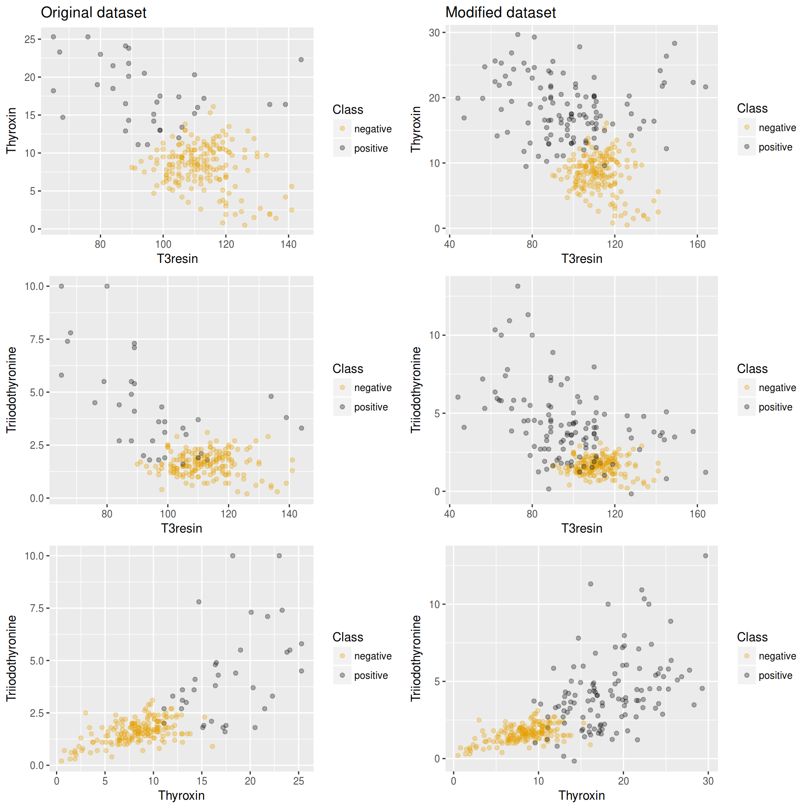
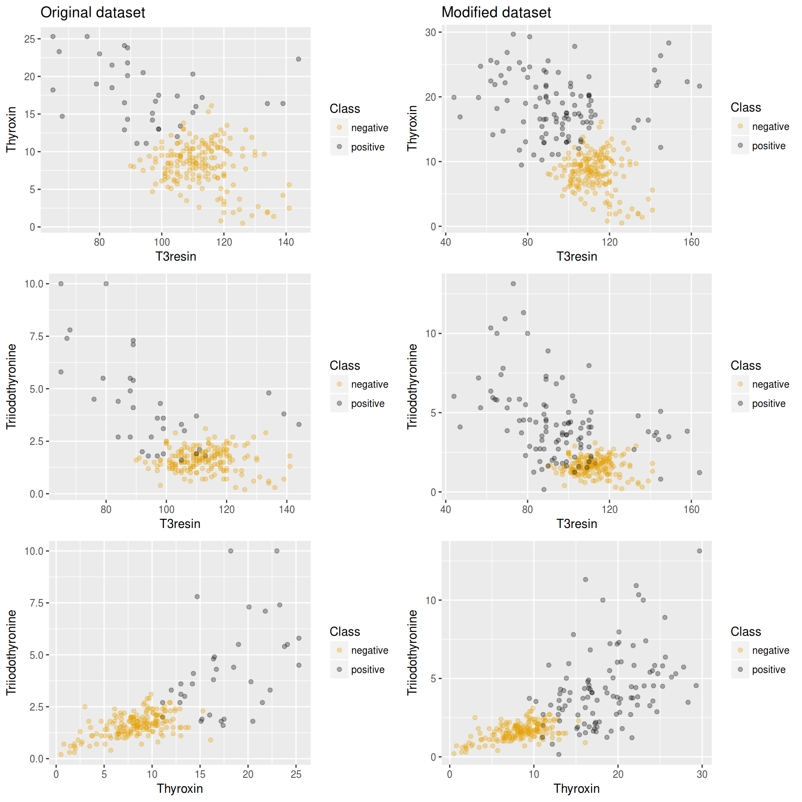

<!-- README.md is generated from README.Rmd. Please edit that file -->
imbalance
=========

[](http://www.repostatus.org/#wip) [](https://travis-ci.org/ncordon/imbalance) [](https://cran.r-project.org/) [](https://cran.r-project.org/package=imbalance) [](https://github.com/ncordon/imbalance/commits/master)

`imbalance` provides a set of tools to work with imbalanced datasets: novel oversampling algorithms, filtering of instances and evaluation of synthetic instances.

Installation
------------

You can install imbalance from Github with:

``` r
# install.packages("devtools")
devtools::install_github("ncordon/imbalance")
```

Examples
--------

Run `pdfos` algorithm on `newthyroid1` imbalanced dataset and plot a comparison between attributes.

``` r
library("imbalance")
data(newthyroid1)

newSamples <- pdfos(newthyroid1, numInstances = 80)
# Join new samples with old imbalanced dataset
newDataset <- rbind(newthyroid1, newSamples)
# Plot a visual comparison between both datasets
plotComparison(newthyroid1, newDataset, attrs = names(newthyroid1)[1:3], cols = 2, classAttr = "Class")
```



After filtering examples with `neater`:

``` r
filteredSamples <- neater(newthyroid1, newSamples, iterations = 500)
#> [1] "15 samples filtered by NEATER"
filteredNewDataset <- rbind(newthyroid1, filteredSamples)
plotComparison(newthyroid1, filteredNewDataset, attrs = names(newthyroid1)[1:3])
```


